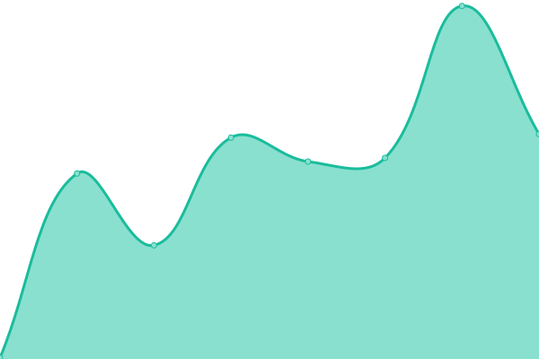

# [📈 Live Status](https://upptime.racca.me): <!--live status--> **🟧 Partial outage**

This repository contains the open-source uptime monitor and status page for [Upptime](https://upptime.js.org), powered by [Upptime](https://github.com/upptime/upptime).

With [Upptime](https://upptime.js.org), you can get your own unlimited and free uptime monitor and status page, powered entirely by a GitHub repository. We use [Issues](https://github.com/upptime/upptime/issues) as incident reports, [Actions](https://github.com/SebaOfficial/upptime/actions) as uptime monitors, and [Pages](https://upptime.racca.me) for the status page.

<!--start: status pages-->
<!-- This summary is generated by Upptime (https://github.com/upptime/upptime) -->
<!-- Do not edit this manually, your changes will be overwritten -->
<!-- prettier-ignore -->
| URL | Status | History | Response Time | Uptime |
| --- | ------ | ------- | ------------- | ------ |
|  [Racca.me](https://racca.me) | 🟩 Up | [racca-me.yml](https://github.com/SebaOfficial/upptime/commits/HEAD/history/racca-me.yml) | 

 733ms
     
 | 

<a href="https://upptime.racca.me/history/racca-me">100.00%</a>
    

|  [Blog](https://blog.racca.me) | 🟩 Up | [blog.yml](https://github.com/SebaOfficial/upptime/commits/HEAD/history/blog.yml) | 

 254ms
     
 | 

<a href="https://upptime.racca.me/history/blog">100.00%</a>
    

|  [TelegramSDK](https://botapi.racca.me) | 🟩 Up | [telegram-sdk.yml](https://github.com/SebaOfficial/upptime/commits/HEAD/history/telegram-sdk.yml) | 

 150ms
     
 | 

<a href="https://upptime.racca.me/history/telegram-sdk">100.00%</a>
    

|  [QWER](https://qwer.racca.me) | 🟩 Up | [qwer.yml](https://github.com/SebaOfficial/upptime/commits/HEAD/history/qwer.yml) | 

 191ms
     
 | 

<a href="https://upptime.racca.me/history/qwer">100.00%</a>
    

|  [Newsletter](https://newsletter.racca.me) | 🟥 Down | [newsletter.yml](https://github.com/SebaOfficial/upptime/commits/HEAD/history/newsletter.yml) | 

 0ms
     
 | 

<a href="https://upptime.racca.me/history/newsletter">6.19%</a>
    

|  [API](https://api.racca.me/ping) | 🟩 Up | [api.yml](https://github.com/SebaOfficial/upptime/commits/HEAD/history/api.yml) | 

 498ms
     
 | 

<a href="https://upptime.racca.me/history/api">100.00%</a>
    

|  [LinkSharer](https://linksharer.js.org) | 🟩 Up | [link-sharer.yml](https://github.com/SebaOfficial/upptime/commits/HEAD/history/link-sharer.yml) | 

 216ms
     
 | 

<a href="https://upptime.racca.me/history/link-sharer">99.19%</a>
    

|  [LinkSharer Demo](https://demo.linksharer.js.org) | 🟩 Up | [link-sharer-demo.yml](https://github.com/SebaOfficial/upptime/commits/HEAD/history/link-sharer-demo.yml) | 

 203ms
     
 | 

<a href="https://upptime.racca.me/history/link-sharer-demo">100.00%</a>
    

<!--end: status pages-->

[**Visit our status website →**](https://upptime.racca.me)

## 📄 License

- Powered by: [Upptime](https://github.com/upptime/upptime)
- Code: [MIT](./LICENSE) © [Anand Chowdhary](https://anandchowdhary.com), supported by [Pabio](https://pabio.com)
- Data in the `./history` directory: [Open Database License](https://opendatacommons.org/licenses/odbl/1-0/)
